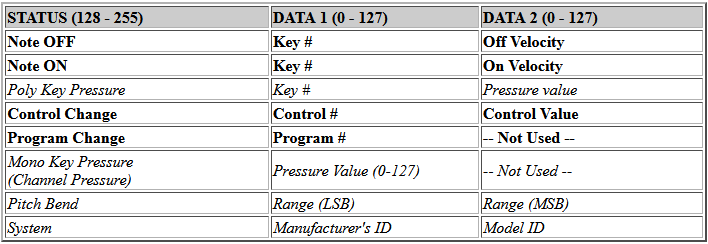
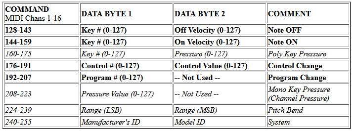
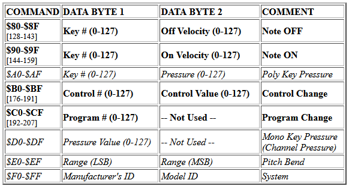

# use

1. instal python on your computer (I used python 3.9)
1.1. install loopMIDI https://www.tobias-erichsen.de/software/loopmidi.html if on Windows
2. open command prompt
3. enable python enviroment `./env/Scripts/activate`
4. run `python simpleOSCtoMIDI.py`

## seting up OSC sender in Resonite

1. create OSC sender componnent

1.1. set active user

1.2. set the URL

2. add OSC value component
3. set OSC value handler to crated sender component
4. drive the value
5. set path in OSC value to `/hex/<status>/<data1>/<data2>` or `/hex/<statue>/<data1>` or `/hex/<status>`

when specifying MIDI data to send with `/hex/*` use hexadecimal strings. example: `0xCB` or `CB` to represent data in MIDI protocol.

samples:

note: `/hex/90/18` set note C1 on channel 1 to OSC value (0-1) float or bool

pitch bend: `/hex/F0` pitch bend channel 1 to  OSC value (0-1) float or bool

control change: `/hex/B2/09` set control 9 on channel 3 to OSC value (0-1) float or bool

# MIDI protocol 
There are EIGHT groups (families) of commands which are sent/received by a MIDI device, usually a synthesizer keyboard, sound module, computer, or other piece of hardware. In some instances, computer software will EMULATE a piece of MIDI hardware.

    1. Note OFF
    2. Note ON
    3. Polyphonic key pressure
    4. Control change
    5. Program change
    6. Monophonic key (channel) pressure
    7. Pitch bend
    8. System exclusive (usually GLOBAL commands affecting the entire device)

A MIDI command consists of a series of numbers which when received by a device through a serial cable (or virtual connection made with software) will cause the device to do something, for example: play a note, change the sound (program), turn a note off, etc.

Except for the SYSTEM EXCLUSIVE command (which can have any quantity of individual numbers from as few as 4 to as many as 1000's), all MIDI commands have either TWO or THREE numbers. For example:

    144 60 127 - turn ON note #60 on MIDI channel 1 with a velocity of 127

    144 60 0 - turn OFF note #60 on MIDI channel 1

    192 15 - change the program (sound) on MIDI channel 1 to program #15

    193 21 - change the program (sound) on MIDI channel 2 to program #21

The FIRST number in any MIDI command is called the STATUS and is always in the range 128 - 255. The number(s) following the STATUS are DATA and are always in the range 0 - 127. 

A MIDI byte (8 bits) can only represent a value from 0-127 since it uses the most significant bit to indicate whether it's a status byte or data byte

Some MIDI commands have only ONE DATA number and some have TWO. Here is a list of the various MIDI COMMANDS along with their respective data requirements (the commands in italics will not be used in this class):

The MIDI specification allows for 16 MIDI channels and MIDI activity can take place on all 16 MIDI channels simultaneously. MIDI channels are identified by individual MIDI commands through the the RANGE of their STATUS numbers.

Pitch Bend 14bit value (0–16383) is split between data1 and data2. data1 contains first 7 (LSB less significant bits) and data2 contains the last 7 (MSB most significant bits)

The range of possible STATUS number is 128 - 255. Here is a list of the EIGHT MIDI command STATUS groups along with the range of numbers for the 16 MIDI channels in each group:

An easier way to deal with the complexity of keeping track of the STATUS number in regards to which MIDI channel it represents is to use HEXADECIMAL numbers instead of DECIMAL. For example, the #192 by itself does not intuitively indicate that that is the STATUS command for changing the program (sound) on MIDI channel 1. However if this table of HEXADECIMAL values was used for the STATUS numbers, it becomes immediately intuitive and easy to memorize:

